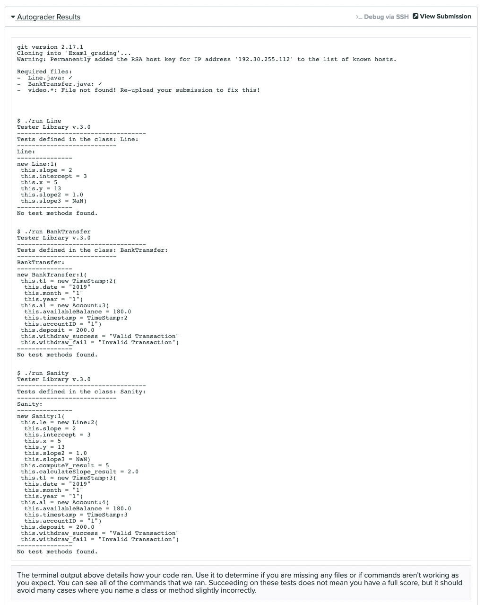

# Exam 1

### Release: 7pm Thursday April 14th, 2022
### Due: 11am Sunday April 17th, 2022

**We will not accept late submissions.**

This page details a take-home exam that you will complete over the next 
day. You can’t communicate with anyone about the content of the assignment
until the exam ends. You can message us privately on Piazza, but the
course staff will not give programming advice or answer most questions about the
problems. If you have technical trouble creating a screencast (detailed below)
feel free to reach out for assistance.

Do not use any online service other than Piazza to ask questions about the
assignment. Do not search for, solicit, or use solutions to the problems that
you find elsewhere for the exam. These are all violations of academic integrity
that students have committed on exams like this in the past.

You can make use of any course notes, online resources about Java and its
libraries, Java tools, and so on to complete the exam, including re-using code
from class notes.

You can review the grading policy for exams in the [syllabus](https://ucsd-cse11-sp22.github.io/syllabus.html).
You will complete the programming task below and submit your work to the [Exam1 Gradescope assignment](https://www.gradescope.com/courses/381041/assignments/1991831).

Submission checklist (see long descriptions below for full details). Make sure that you follow the same filenames as mentioned below:

- [ ] `Line.java` containing methods for Task 1
- [ ] `BankTransfer.java` containing code for Task 2
- [ ] `video.*` (`*` means whatever extension you have; we *really* prefer `mp4`, which is what Zoom produces. If you use an extension other than mp4, check that it plays in Gradescope!)

Make sure to look at your Gradescope submission after submitting to see if all the required files are there.

### **Task 1 and 2 will be autograded. Task 3 will be manually graded** 

Make sure that your submission passes autograder for your code to be properly graded. 

If you are having issues with getting the autograder to run successfully, you may find it helpful to consult the [Developing with the Gradescope Autograder in Mind](https://docs.google.com/document/d/1IKSDkG4kHC0gb2FyqdeOWJOAbQr6UCvYZSToIBopfVs/edit?usp=sharing) guide.

If your submission passes the autograder, then you should see output similar to:

Be aware that the Compile check does not check for code correctness, but rather that your code compiles. Additionally, if your code errors or throws exceptions unexpectedly, the autograder will not grade your submission. This will result in 0 points being given for that particular task.

Your submission will be graded **after** the deadline. You should test thoroughly yourself to make sure your program works as expected.

## Clarifications

**Can I use a Java feature/library/method that we haven't covered in class?**

No. Strive to create a solution that only uses concepts covered so far in the course.

**I can't get my code to run on my computer.**

Ideally, you should have already solved this issue as we are running programs the same way as PA1 and PA2. But you may try reviewing the
previous public Piazza posts, which have lots of advice about fixing these
situations. Also make sure that your code doesn't have a bug before you blame
your computer or `./run`!

**I get a score of 0.0/0.0 on autograder.**

This is expected, we will reveal scores after the exam has concluded.

**It says the autograder didn't run successfully.**
 
Make sure that your code has no errors and you match the specification for **ALL** classes and method headers exactly.

**Can I submit multiple times until the deadline?**

Yes, we will grade the last submission you make before the deadline.

## Tasks

You can find the starter code in this repository [https://github.com/ucsd-cse11-sp22/cse11-exam1-starter](https://github.com/ucsd-cse11-sp22/cse11-exam1-starter).

### Task 1 - Geometry

In the `Line` class in `Line.java`, you will use the design recipe to write two methods:

- `computeY`, which takes three integers representing the `slope (m), x coordinate (x) and intercept(c)` and returns the the y coordinate (int) using the formula:
`Y = m (slope) * x (x coordinate) + c (intercept)`

- `calculateSlope`, takes four doubles representing the two points needed to calculate the `slope`. The first two doubles represent the first point `x1` and `y1`. The third and fourth doubles represent the second point `x2` and `y2`. Your task is to return the slope (double) using the formula: `Slope = (y₂ – y₁) /  (x₂ – x₁)`

- To verify that your code works correctly, call your methods in the `Line` class. Make sure you show at least one example for each of the methods above. Also include another example where `calculateSlope` would result in a mathematical error.

Note that it’s fine to add more methods than what we’ve listed, but these two methods must appear as described.

Note that you should use the full design recipe – include enough examples to convince yourself the method works

### Task 2

In `BankTransfer.java`, you will add:
- A new class called `TimeStamp` that represents a particular time an event occurred.
- The timestamp must have a `String` field called `day`, a `String` field called `month`, and a `String` field called `year`.
- A constructor for `TimeStamp` that takes arguments `day`, `month`, and `year` in that order.

In `BankTransfer.java`, you will add:
- A new class called `Account` that represents a bank account.
- The account must have a `double` field called `availableBalance` that represents how much money is in the account, a `TimeStamp` field called `timestamp` that represents when the account was opened, and a `String` field called `accountID` that represents the id number for the account.
- A constructor for `Account` that takes arguments `availableBalance`, `timestamp`, and `accountID` in that order.

Additionally, you will add 2 methods to the `Account` class.

- A new method called `deposit` that takes 1 `double` parameter representing the transaction amount and updates the `availableBalance` field by adding the amount to this (the object that called the method) current object. You will return the new `availableBalance` after it has been updated.

- A new method called `withdraw` that takes 1 `double` representing the amount to be withdrawn and updates the `availableBalance` field by subtracting the amount if this current object (the object that called the method) has an `availableBalance` greater than or equal to the amount. 
- If the withdrawal is successful, return a string stating `“Valid Transaction”`. Do not include the quotes.
- In case there is no sufficient balance, return a string stating `“Invalid Transaction”`. Do not include the quotes. Do not update the balance in this case. 

In the `BankTransfer class`, you will add and save to a field:

- At least 1 `TimeStamp` object
- At least 1 `Account` object
- At least 1 example of the `deposit` method (using the `Account` object created)
- At least 2 examples of the `withdraw` method (using the `Account` object created), where both cases must be shown.

To verify that your code is working correctly, use the run command and check whether the output on the command line is what you expect. 

### Task 3 – Video

You will record a short video of no more than 5 minutes. Include:

- Show only your face and a picture ID (your student ID is preferred but any picture ID with your name on it will work) for a few seconds at the beginning. Be sure state your name as well. You don’t have to be on camera the whole time, though it’s fine if you are. Just a brief confirmation that it’s you creating the video/doing the work attached to the work itself is what we want. If you do not have a webcam, take a picture of yourself (and your picture ID) with your phone and display that picture at the start of your screen share.

Your task:
- For `Task 1:` Run and explain one example for your `calculateSlope` method. Also explain the case where the `calculateSlope` method would result in a mathematical error.  We want to see the implementation of this method written in your `Line.java` file. Make sure you trace through your code and show the output printed to the console.
- For `Task 2:` Run and explain the 2 examples (valid and invalid transaction) you wrote for the `withdraw` method. We want to see the implementation of this method written in your `BankTransfer.java` file. Make sure you trace through your code and show the output printed to the console.

An example of what your video should look like when doing this kind of explanation is here:

[https://drive.google.com/file/d/117NfZaHXbHtMJZJmLRVeRy-1b9cY3jei/view?usp=sharing](https://drive.google.com/file/d/117NfZaHXbHtMJZJmLRVeRy-1b9cY3jei/view?usp=sharing)

Here is a tutorial for creating a screencast like this [https://ucsd-cse11-sp22.github.io/assignments/pa2.html](https://ucsd-cse11-sp22.github.io/assignments/pa2.html).

Here are some notes on how to improve your videos:

- Make sure to use a picture ID, either a student ID _with a photo_, a driver's license, or passport that has a picture of you. If you do not provide a picture ID, you may get a 0 on the exam until prove to us it was you who did the video.
- Make sure your picture ID and face are visible at the same time for three or four seconds. We must be able to pause the video and verify it's you. Again, if we can't verify it's you, you will get a 0 on the exam until prove to us it was you who did the video. Make sure to fill up the screen as much as possible with your face and picture id (i.e. don't stand far away from your camera).
- When you start recording your video, start with screen share off and camera on and show your picture ID and face (close-up!!). Then you can enable screen share (and disable camera) and walk through your code.
- Video must have sound! While highlighting your code, also make sure to explain the code. We must hear you explain it!
- Once you enable screen share, make sure to leave it on the entire time while explaining your code.
- Do not explain every test case! Only explain what you are explicitly told in the tasks above.
- Keep your videos under 5 minutes; videos even a second over 5 minutes will get a penalty on the video part, this is to ensure we can grade them promptly. To ensure you stay under 5 minutes, make sure to only explain what is described above, and do a few practices or make a script before you start recording.
