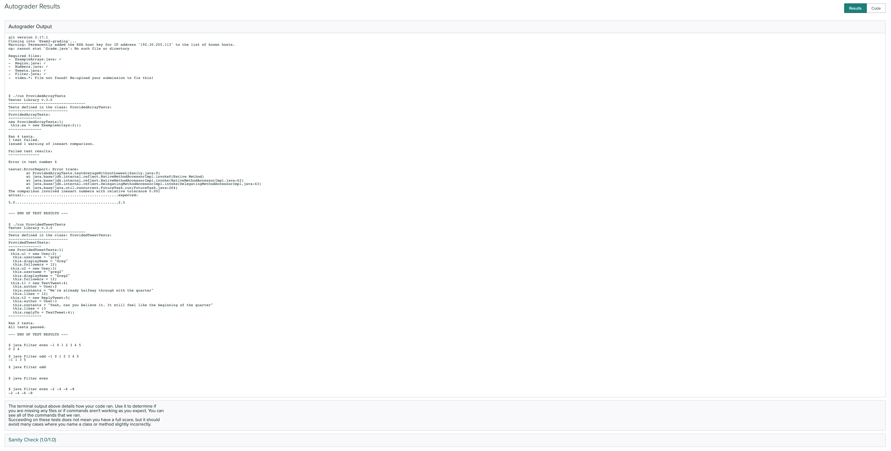
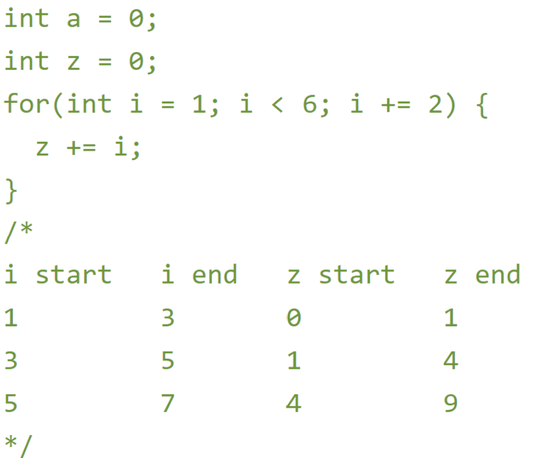

# Final Exam

### Release: 8am Saturday June 4, 2022
### Due: 8am Saturday June 7, 2022


This page details a take-home exam that you will complete over the next few
days. You can’t communicate with anyone about the content of the assignment
until you receive your grade (this includes Discord). You can message us privately on Piazza, but the
course staff will not give programming advice or answer most questions, including clarifications, about the
problems. If you have technical trouble creating a screencast (detailed below)
feel free to reach out for assistance.

Do not use any online service other than Piazza to ask questions about the
assignment. Do not search for, solicit, or use solutions to the problems that
you find elsewhere for the exam. These are all violations of academic integrity
that students have committed on exams like this in the past. Please use good judgement 
and take this exam with integrity and honor. 

You can make use of any course notes, online resources about Java and its
libraries, Java tools, and so on to complete the exam, including re-using code
from class notes.

You can review the grading policy for exams in the [syllabus](/syllabus.html).
You will complete the programming task below and submit your work to the appropriate Gradescope assignment for each part of the exam.

Starter code is available here:

[https://github.com/ucsd-cse11-sp22/cse11-finalexam-starter](https://github.com/ucsd-cse11-sp22/cse11-finalexam-starter)

The starter code will contain 3 folders, each of which will be labeled and will contain starter code corresponding to that portion of the Final Exam.

The starter code has been marked with the following annotation:

```java
// Task #.#: [Title]
// Your code here
```
You will only need to add code where you see this annotation.

Make sure to look at your Gradescope submission after submitting to see if all the required files are there.


### **All coding tasks will be autograded.** 

Make sure that your submission passes autograder for your code to be properly graded. 

If you are having issues with getting the autograder to run successfully, you may find it helpful to consult the [Developing with the Gradescope Autograder in Mind](https://docs.google.com/document/d/1IKSDkG4kHC0gb2FyqdeOWJOAbQr6UCvYZSToIBopfVs/edit?usp=sharing) guide.

If your submission passes the autograder, then you should see output similar to:

{:width="100%"}

Be aware that the Sanity check does not check for code correctness, but rather that your code compiles. 

Your submission will be graded **after** the deadline. You should test thoroughly yourself to make sure your program works as expected.

## Clarifications

**Can I use a Java feature/library/method that we haven't covered in class?**

Yes, just make sure it doesn't break the autograder. The course staff is not responsible for fixing any submissions that fail the autograder during or after the exam. 

**Can we write more methods than specified?**

Yes, you can write additional helper methods.

**Can I use previous code that I wrote for a PA in my exam?**

Yes.

## Final Exam - Part 1
This part of the final corresponds to Exam 1 material. A set of incomplete tests will be provided in Sanity.java.

You will submit the following files to the `Final Exam - Part 1` Gradescope assignment:
- [ ] `AccountTester.java` containing code for Task 1
- [ ] `Task2.java` containing code for Task 2
- [ ] `Task2-diagram.png` containing image for Task 2 (or another similar image file type)
- [ ] `video.*` (* means whatever extension you have; we really prefer mp4, which is what Zoom produces. If you use an extension other than mp4, check that it plays in Gradescope!)

### Task 1 – Interest Calculation
In `AccountTester.java`, you will add three new classes - `Duration, Account and AccountTester.`

In the `Duration class`, you will add:

- A constructor for Duration that takes the arguments `numMonths` and `numYears` in that order.

- A method called `calculateNumYears` that takes in no parameters and returns a `double` representing the total number of years obtained by adding the `numYears` field with the `numMonths` field. (Ensure that the `numMonths` field is converted to represent years appropriately).

In the `Account class`, you will add:

- A constructor for `Account` that takes the arguments `account_id (string), name (string), amount (double)` in that order.

- A helper method called `getSimpleInterest` that takes in two arguments. The first represents the `rate per year (double)`. The rate will be given as a number which will be represented as a percentage. (For Example: 10 represents 10% rate per year). The second represents the `duration (object from the duration class)`.  This method should return a `double` representing the interest to be paid by using the formula:

```
Simple Interest = (Amount * Rate per year * Time (in years)) / 100
```

- A new method called `canPayInterest` that takes in three arguments. The first represents the `rate per year (double)` and the second represents the `duration (object from the duration class)` and the third represents `moneyAvailable (double)`. This method should return a `boolean` which should be equal to `true` if the `moneyAvailable` is greater than or equal to the interest. It should return `false` in all other cases.

In the AccountTester class, you will add and save to a field:

- At least 1 `Duration` object
- At least 1 `Account` object
- At least 2 examples of the `canPayInterest` method (using the Account object created), where both outcomes are shown.

To verify that your code is working correctly, use the run command and check whether the output on the command line is what you expect.


### Task 2 – Memory Model

#### Task 2 Code

In the file `Task2.java`, add the following class definition (you can copy/paste them from here):

```
class Point {
    int x, y;
    Point(int x, int y) {
        this.x = x;
        this.y = y;
    }
}
```

Then add a class definition called `Triangle` with the following specifications:
- A constructor for `Triangle` that takes in three points as arguments. (For example: Point p1, Point p2, Point p3)

Then add a class definition called `Task2`:
- Three point objects named `p1, p2 and p3`. Ensure that the values of the points allow a valid triangle to be created. (That is, the points should not lie on a line)
- A `Triangle` object, named `(t)` formed from the above three points using the `Triangle` class definition.

#### Task 2 Memory Diagram

Create a memory diagram of the objects you created. Focus on the objects as they appear in the output and as created at the end of the program (there are no meaningful stack frames to draw). Submit the memory diagram in `Task2-diagram.png` (or another similar image file type). Submit the code in `Task2.java`.

Your memory diagram should include:
- All of the objects created, with accurate field values and class names
- A unique reference for each object
- Accurate uses of references between objects

You can draw it on paper and take a picture, draw it digitally, or use a tool like [Google Drawing](https://drawings.new/) to create it.


### Task 3 – Video

You will record a short video of no more than 3 minutes. Include:

- Show only your face and a picture ID (your student ID is preferred but any picture ID with your name on it will work) for a few seconds at the beginning. Be sure to state your name as well. You don’t have to be on camera the whole time, though it’s fine if you are. Just a brief confirmation that it’s you creating the video/doing the work attached to the work itself is what we want. If you do not have a webcam, take a picture of yourself (and your picture ID) with your phone and display that picture at the start of your screen share.

Your task:

- For `Task 1`: Run and verbally explain the 2 outcomes for the `canPayInterest` method (one where the outcome is `true` and one where the outcome is `false`). We want to see the implementation of this method written in your `AccountTester.java` file. Make sure you trace through your code and show the output printed to the console.

An example of what your video should look like when doing this kind of explanation is here:

https://drive.google.com/file/d/117NfZaHXbHtMJZJmLRVeRy-1b9cY3jei/view?usp=sharing

Here is a tutorial for creating a screencast like this https://ucsd-cse11-sp22.github.io/assignments/pa2.html.

Here are some notes on how to improve your videos:

- Make sure to use a picture ID, either a student ID with a photo, a driver’s license, or passport that has a picture of you. If you do not provide a picture ID, you may get a 0 on the exam until prove to us it was you who did the video.
- Make sure your picture ID and face are visible at the same time for three or four seconds. We must be able to pause the video and verify it’s you. Again, if we can’t verify it’s you, you will get a 0 on the exam until prove to us it was you who did the video. Make sure to fill up the screen as much as possible with your face and picture id (i.e. don’t stand far away from your camera).
- When you start recording your video, start with screen share off and camera on and show your picture ID and face (close-up!!). Then you can enable screen share (and disable camera) and walk through your code.
- Video must have sound! While highlighting your code, also make sure to explain the code. We must hear you explain it!
- Once you enable screen share, make sure to leave it on the entire time while explaining your code.
- Do not explain every test case! Only explain what you are explicitly told in the tasks above.
- Keep your videos under 5 minutes; videos even a second over 5 minutes will get a penalty on the video part, this is to ensure we can grade them promptly. To ensure you stay under 5 minutes, make sure to only explain what is described above, and do a few practices or make a script before you start recording.


## Final Exam - Part 2

This part of the final corresponds to Exam 2 material. A set of incomplete tests will be provided in Sanity.java.

You will submit the following files to the `Final Exam - Part 2` Gradescope assignment:
- [ ] `Mode.java`
- [ ] `Even.java`
- [ ] `Area.java`
- [ ] `video.*`

### Task 1 - Mode

In the class `Mode` in `Mode.java`, you will write a single method called `mode` that takes an `int[]` as argument and return an `int`. The `int[]` is a list of numbers from the range of 0 to 9 in any order, but one number is missing from this range. Your task is to find this missing number and return it. 

If there is no missing number then you can just return -1. You can assume that all the numbers in this list are different, in other words, each number from 0 to 9 only appears once in the argument list. You can also assume that only one number from 0 to 9 is missing for any test cases.  

Example: 
Input: [2,3,4,9,5,6,0,7,8]
Expected output: 1

### Task 2 - Even Numbers

In the class `Even` in `Even.java`, you will write a `main` method that will read a non-negative number from the command line, and will print (on a new line) each even digit from this number. If there is nothing passed to your program from the command line or if there are no even digits, print nothing, not even a new line. 

Notes:
- The number from command line is a string so when you are getting each digit from the number, be careful of its type (`int` or `char` or `String`)
- You can assume that we will always put in a number as argument, so nothing such as this string “a1c3b”
- When printing the digits, make sure that they are `String`

Example: 
java Even 12346
2
4
6

### Task 3 - ToText

In the file `Area.java`, we have provided code for the `Shape` interface and 4 classes that implement `Shape`. Your task will be to add a `findArea()` method to the `Shape` interface and implement it in all 4 classes. The 4 classes are: Square, Circle, Triangle and Trapezoid

For all the `findArea()` methods, please return a `double` that represents the area of the shape. 

If you are unsure about the area formula for any shapes, you are free to google the formula. 

Notes:
Please be careful with the calculation since we are working with `int` and returning a `double`. I recommend converting everything to `double` before doing the calculation.
For the area of the Circle, please use the pi value of 3.14 for calculation. 


### Video Task
Create a video of no more than 5 minutes:

- Show your ID as usual
- Run an example of `mode` where the mode is not the first or last element in the array. Show the output, then write a loop table of a single loop in the body of `mode` showing each variable's value before and after each loop iteration. Put this table as a comment and follow the same format as described in the video task for [Exam 2](https://ucsd-cse11-sp22.github.io/assignments/exam2.html). Note that you will need to show any variables that you create and change over time in the loop. 

{:width="100%"}

- Be sure to verbally explain your steps as you complete the above task.
- There is no video task associated with Task 2 and Task 3

## Final Exam - Part 3
This part of the final corresponds to Exam 3 material. A set of incomplete tests will be provided in `Sanity.java`.

You will submit the following files to the `Final Exam - Part 3` Gradescope assignment:
- [ ] `SumAt.java`
- [ ] `OccurrenceSum.java`
- [ ] `video.*`

### Task 1 - SumAt

Consider the following interface:
```java
interface SumAt<T> {
    int getSum(T t);
}
```

In the class `Sum`, you will write a non-static generic method called `sumAt` which will take a generic type <T> `List` as its first argument, a generic type <T> `SumAt` object as its second argument. The third argument will be an 'int' representing an index in the list. The method will return a single 'int' representing the "sum of the element" in the list, at the index specified by the third argument, by using the corresponding SumAt() class. 

If the index element in the list is `null` or if any of the arguments are `null`, return `0`.

### Task 2 - OccurrenceSum

In the class `OccurrenceSum` in `OccurrenceSum.java`, you will write a program that will take csv file names as command line arguments. Each csv consists of  'word,value' pairs separated by a new line. Words may appear multiple times in the csv and across csv files. Print out the word whose total value is the greatest across all data files along with the number sum of the total value. You should print out each pair of values in the form `word, total_value`. As an example, for `java OccurrenceSum data_1.csv data_2.csv data_3.csv`, your code should print `occasion, 170`. If there are ties, then print all the ties on a new line (in any order). If no csv file names are given or all csv files are empty, then print nothing, not even a new line. You are allowed to import and use Java libraries.

### Video Task

Create a video of no more than 5 minutes:

- Show your Face and ID as usual
- For `sumAt`, write a new example where `List` and `SumAt` use some custom type that you define (consider 'String' or 'Boolean') and there are at least 3 elements in the `List`. Draw a stack trace of all the active method calls as your program sums up the second element in the `List`. Note, this means that the `getSum` method will be in the process of executing. Follow the same format as described in the video task for [Exam 3](https://ucsd-cse11-sp22.github.io/assignments/exam3.html)
- Be sure to verbally explain your steps as you complete the above task.
- There is no video task associated with Task 2
